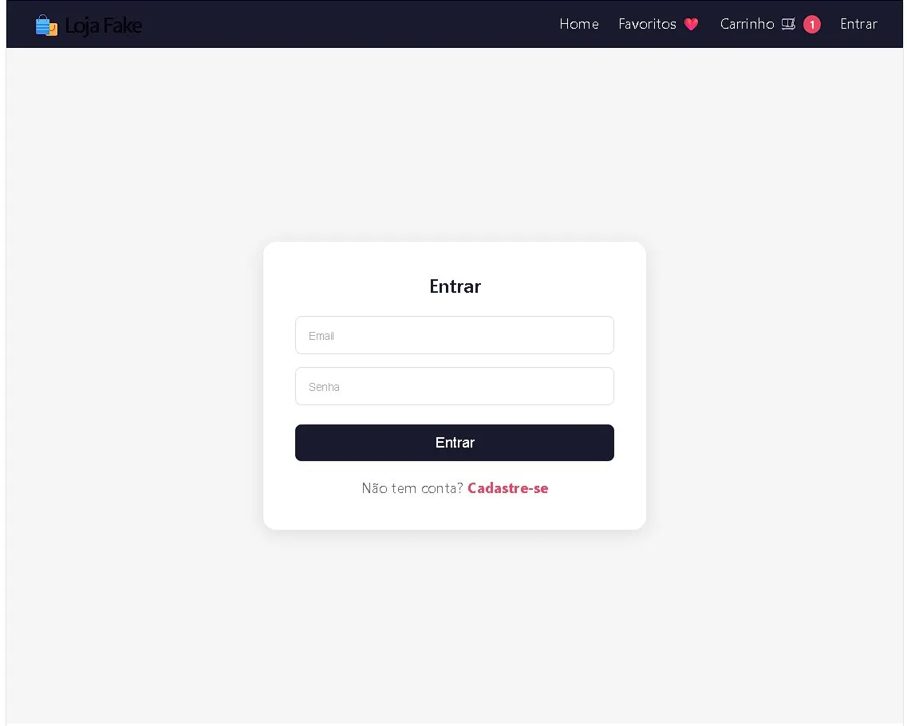
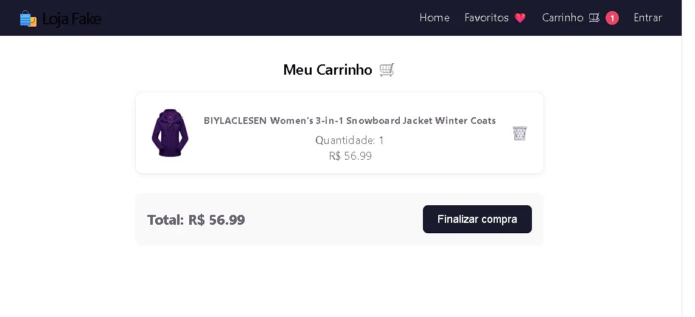

# 🛍️ Loja Fake

Uma loja virtual completa construída com React, consumindo a [Fake Store API](https://fakestoreapi.com/).


## ✨ Funcionalidades

- 📦 Listagem de produtos via API
- 🔍 Busca por nome em tempo real
- 🗂️ Filtro por categoria
- ❤️ Favoritos salvos no navegador
- 🛒 Carrinho de compras com quantidade e total
- 👤 Login e Cadastro de usuários
- 🔀 Navegação entre páginas (React Router)

## 🖼️ Screenshots

| Home | Login | Carrinho |
|------|-------|----------|
|  |  |  |

## 🚀 Tecnologias

- [React](https://react.dev/)
- [Vite](https://vitejs.dev/)
- [React Router DOM](https://reactrouter.com/)
- [Fake Store API](https://fakestoreapi.com/)
- Context API
- LocalStorage

## 📁 Estrutura do projeto
src/
├── components/
│   ├── Header.jsx
│   └── ProductList.jsx
├── context/
│   ├── AuthContext.jsx
│   └── CartContext.jsx
├── pages/
│   ├── CartPage.jsx
│   └── LoginPage.jsx
└── App.jsx

## 💻 Como rodar localmente

```bash
# Clone o repositório
git clone https://github.com/gabriellesca/loja-fake.git

# Entre na pasta
cd loja-fake

# Instale as dependências
npm install

# Rode o projeto
npm run dev
```

## 👩‍💻 Desenvolvido por

**Gabrielle Cunha** — [LinkedIn](https://linkedin.com/in/gabriellesca) · [GitHub](https://github.com/gabriellesca)